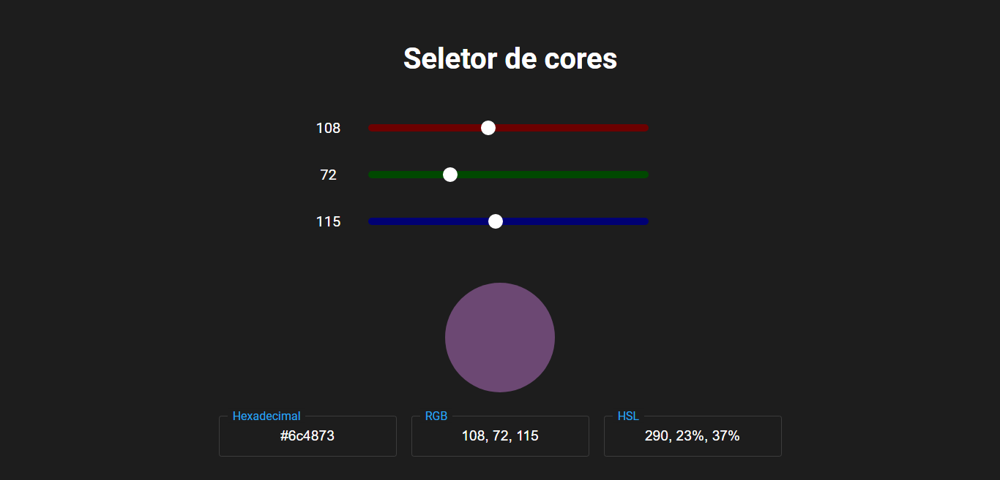

<h1 align="center">Seletor de cores<h1>

## 💻 Projeto

Este projeto é um color picker de cores no formato rgb, hexadecimal e hsl.

 

<h2 align="left">🚀 Tecnologias utilizadas </h2>

    
    
    

 

## ✅ Demonstração da aplicação
 

    

 

## 📝 Licença

Esse projeto está sob a licença MIT. Veja o arquivo [LICENSE](.github/LICENSE.md) para mais detalhes.

